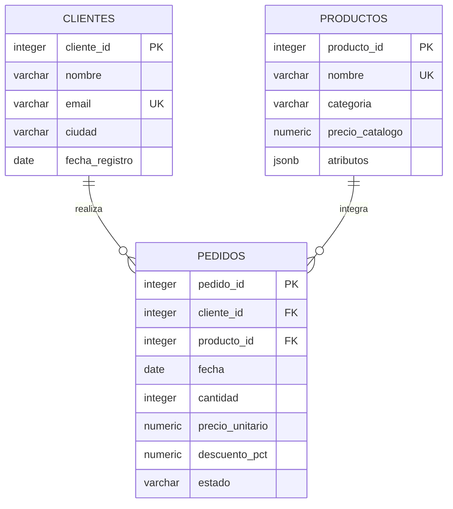

# Análisis exploratorio de ventas con PostgreSQL

**Carolina Machado · Proyecto Capstone · SQL (diplomatura), Coderhouse**

## Problema de negocio

La cafetería ficticia **La Estación** necesita comprender qué clientes y categorías aportan más ingresos, cómo evolucionan las ventas y qué productos tienen baja salida. Antes de analizar, debe corregir cargas duplicadas y valores ausentes o inválidos.

El proyecto reproduce ese proceso de principio a fin: generación de datos originales, diagnóstico, limpieza, validación, análisis e interpretación. Todos los clientes, ventas y precios son **sintéticos**, generados para esta práctica según la alternativa admitida por la consigna. No son datos del Hipódromo ni resultados de una empresa real.

**Período:** enero a junio de 2026. **Moneda:** pesos argentinos ficticios (ARS). **Motor objetivo:** PostgreSQL 16 o superior. No requiere extensiones ni archivos externos.

## Archivos

| Archivo | Función |
|---|---|
| `estructura.sql` | Crea tablas, genera datos, diagnostica, limpia y concilia la carga. |
| `analisis.sql` | Contiene ocho análisis de negocio y tres bloques complementarios de control, JSONB y rendimiento. |
| `README.md` | Explica metodología, ejecución, resultados y limitaciones. |

## Modelo de datos y granularidad

El esquema `capstone` separa el trabajo de otros objetos de la base.



Cada fila de `pedidos` representa **un pedido de un único producto**, que puede incluir varias unidades. Esta simplificación está permitida en el material. Para tickets con productos diferentes se necesitaría una cuarta tabla `detalle_pedido`; no se simula esa situación aquí.

Los nombres y atributos de clientes/productos no se repiten en cada pedido. Cada tabla tiene una clave primaria; los pedidos referencian a las otras dos mediante claves foráneas. Los atributos del negocio tienen valores atómicos y dependen de su clave, cumpliendo las primeras formas normales dentro del alcance definido. `atributos` conserva únicamente características variables de apoyo en JSONB, fuera de las claves y métricas monetarias.

Objetos adicionales:

- `pedidos_origen`: conserva las 398 filas originales, incluidas las defectuosas.
- `v_pedidos_normalizados`: transforma tipos y clasifica cada fila con una causa principal.
- `pedidos_rechazados`: conserva la referencia a las filas apartadas y su motivo.
- `v_ventas`: centraliza las ventas completadas y la fórmula monetaria.

## Reglas de negocio

1. Solo los pedidos `completado` aportan ingresos. Las cancelaciones se conservan para un análisis separado.
2. Ingreso neto por pedido = `ROUND(cantidad × precio_unitario × (1 − descuento_pct / 100), 2)`.
3. Se usa el **precio histórico del comprobante**, nunca el catálogo actual para reconstruir ventas.
4. Los importes son netos de descuentos. No se modelan costos, impuestos, propinas, reintegros ni inflación: **ingresos no significa rentabilidad**.
5. Los duplicados inyectados son copias idénticas. Se conserva el menor `registro_id` de cada `pedido_id`. En un sistema con versiones distintas sería necesaria una política de versionado adicional.
6. En este origen sintético un descuento vacío significa que no hubo promoción, por lo que corresponde reemplazarlo por cero. Esa regla no se supone válida para cualquier fuente real.
7. Una fecha o un precio sin respaldo confiable no se inventa: el registro queda fuera del análisis y puede auditarse.

## Dataset y limpieza

Se generan 30 clientes, 12 productos y 390 pedidos únicos. El volumen de pedidos aumenta por construcción de 40 en enero a 90 en junio. Los clientes 29 y 30 no compran; el producto 12 no tiene ventas. Son casos de prueba intencionales.

Además se agregan dos duplicados y seis filas defectuosas. Los IDs, las fechas y los precios son reproducibles: no se usa `random()` ni se depende de la fecha del día.

| Situación | Tratamiento |
|---|---|
| Cinco precios nulos en pedidos válidos | `COALESCE` recupera el precio del comprobante de ese pedido. |
| Tres fechas nulas recuperables | `COALESCE` recupera la fecha del comprobante. |
| Una fecha ausente sin respaldo y una fecha imposible | Se apartan como `fecha_no_recuperable`. |
| 78 descuentos vacíos en el origen | Se convierten a cero según la regla documentada de la fuente. |
| Tres precios con coma decimal | Se normaliza la coma a punto antes de convertir a `NUMERIC`. |
| Espacios y diferencias de mayúsculas en estado | `btrim` y `lower` unifican los valores. |
| Dos reintentos idénticos de carga | `ROW_NUMBER` conserva una sola copia por ID. |
| Cliente inexistente, producto inexistente, cantidad cero y precio negativo | Se apartan con motivos explícitos. |

Los textos vacíos se convierten en nulos mediante `NULLIF`. Las conversiones de fechas e importes se validan antes del cast. `pg_input_is_valid` requiere PostgreSQL 16 o superior. Los tipos finales son `DATE`, `INTEGER` y `NUMERIC`, con `NOT NULL`, claves y restricciones `CHECK`.

### Conciliación obtenida

| Resultado | Filas |
|---|---:|
| Origen | 398 |
| Aceptados | 390 |
| Duplicados apartados | 2 |
| Fecha no recuperable | 2 |
| Cliente inexistente | 1 |
| Producto inexistente | 1 |
| Cantidad inválida | 1 |
| Precio inválido | 1 |

**398 = 390 + 8.** Entre los 390 pedidos aceptados hay 368 completados y 22 cancelados. El control de carga detiene la transacción si no cierra la conciliación o no se obtienen los 390 pedidos previstos.

## Preguntas y resultados

### 1. ¿Quiénes son los cinco clientes de mayor gasto?

Consulta Q1: `JOIN`, `GROUP BY`, `SUM`, ventana de total general y orden determinista.

| Cliente | Pedidos completados | Gasto ARS | Participación |
|---|---:|---:|---:|
| Cliente 25 | 21 | 300.500 | 9,61 % |
| Cliente 09 | 22 | 244.200 | 7,81 % |
| Cliente 13 | 20 | 203.780 | 6,52 % |
| Cliente 28 | 10 | 172.000 | 5,50 % |
| Cliente 16 | 11 | 171.600 | 5,49 % |

Los cinco concentran **34,92 % de los ingresos** (calculado antes de redondear cada participación). En este caso ficticio convendría estudiar su frecuencia y preferencias antes de ofrecer descuentos generales. Un gasto elevado no demuestra lealtad futura ni rentabilidad.

### 2. ¿Cómo evolucionan ventas y ticket promedio?

Consulta Q2: `DATE_TRUNC`, calendario, `LEFT JOIN`, `LAG`, `NULLIF` y acumulado con marco `ROWS` explícito.

| Mes 2026 | Pedidos completados | Ingresos ARS | Ticket ARS | Variación mensual |
|---|---:|---:|---:|---:|
| Enero | 38 | 302.710 | 7.966,05 | No aplica |
| Febrero | 47 | 399.340 | 8.496,60 | 31,92 % |
| Marzo | 57 | 501.240 | 8.793,68 | 25,52 % |
| Abril | 66 | 564.160 | 8.547,88 | 12,55 % |
| Mayo | 75 | 637.360 | 8.498,13 | 12,98 % |
| Junio | 85 | 722.940 | 8.505,18 | 13,43 % |

Total: **ARS 3.127.750**. Junio supera a enero en 138,82 %. El aumento se explica principalmente por más pedidos; el ticket no crece de forma sostenida. Como el volumen creciente fue diseñado, esto demuestra la consulta y no prueba una tendencia real ni el éxito de una campaña. Con datos reales se verificarían días abiertos, precios y estacionalidad.

### 3. ¿Qué productos tienen menor salida?

Consulta Q3 conserva todo el catálogo con `LEFT JOIN` y completa totales ausentes con `COALESCE`.

| Producto | Unidades vendidas | Pedidos | Ingresos ARS |
|---|---:|---:|---:|
| Chocolate frío | 0 | 0 | 0 |
| Combo degustación | 10 | 4 | 120.000 |
| Sándwich de pollo | 56 | 29 | 459.000 |

El chocolate requiere revisar disponibilidad y exposición; no tener ventas no prueba rechazo del cliente. El combo tiene bajo volumen pero alto importe por pedido. Por ello no se recomienda discontinuar productos solo por su ranking de unidades.

### 4. ¿Qué pedidos lideran cada categoría?

Q4 utiliza `RANK() OVER (PARTITION BY categoria ORDER BY ingreso_neto DESC)` sobre pedidos individuales. Los máximos son ARS 11.400 en Bebidas, ARS 36.000 en Comidas y ARS 12.600 en Panadería.

Se muestran posiciones de ranking hasta tres, respetando empates. Por eso el resultado tiene 33 filas: no significa que la consulta deba devolver exactamente nueve. Si el negocio pidiera exactamente tres pedidos por categoría, correspondería `ROW_NUMBER` con un criterio de desempate explícito.

### 5. ¿Qué categorías superan ARS 500.000 semestrales?

Q5 usa `HAVING` después de agrupar.

| Categoría | Pedidos | Unidades | Ingresos ARS |
|---|---:|---:|---:|
| Comidas | 106 | 207 | 1.580.780 |
| Bebidas | 146 | 300 | 832.490 |
| Panadería | 116 | 228 | 714.480 |

Comidas representa **50,54 %** de los ingresos, aunque Bebidas tiene más pedidos. Una decisión razonable para este escenario sería comprobar capacidad y disponibilidad de Comidas. Faltan costos y márgenes para decidir prioridades de rentabilidad. El umbral de ARS 500.000 es exploratorio.

### Análisis complementarios

- **Q6:** clientes 29 y 30, registrados sin compras completadas. Se podrían estudiar barreras de primera compra; el dataset no indica su causa.
- **Q7:** 18 combinaciones de seis meses y tres categorías. Compara cada mes con el promedio de su categoría durante todo el semestre. Es una comparación retrospectiva, no una predicción ni un promedio solo de meses anteriores.
- **Q8:** 22 cancelaciones, **5,64 %** de los 390 pedidos. Representan ARS 186.780 de importe nominal no reconocido como ingreso. No equivale automáticamente a pérdida recuperable.
- **Q9:** reproduce la conciliación de calidad.
- **Q10:** extrae temperatura desde JSONB e identifica Limonada y Chocolate frío como bebidas frías.
- **Q11:** muestra el plan real de un `SELECT` de junio. Con un dataset pequeño, un escaneo secuencial puede ser adecuado; no se afirma una mejora de rendimiento no medida.

## Cómo ejecutar en pgAdmin o DBeaver

1. Conectarse a un servidor **PostgreSQL 16 o superior**. Comprobarlo con `SELECT version();`.
2. Abrir un editor conectado a `postgres` y ejecutar **solamente**:

   ```sql
   CREATE DATABASE capstone_project;
   ```

   Este comando debe ejecutarse con autocommit, fuera de `BEGIN`. El usuario necesita permiso para crear bases; si no lo tiene, un administrador puede crearla.

3. Cambiar la conexión del editor a `capstone_project`. Abrir `estructura.sql` y ejecutar el archivo completo. En DBeaver, usar la ejecución de script, no solo la sentencia del cursor.
4. Ejecutar `analisis.sql` en la misma base. Se puede ejecutar completo o cada bloque Q1–Q11 individualmente para ver su resultado.
5. Comprobar estos resultados básicos:

   ```sql
   SELECT COUNT(*) FROM capstone.pedidos; -- 390
   SELECT COUNT(*) FROM capstone.v_ventas; -- 368
   SELECT SUM(ingreso_neto) FROM capstone.v_ventas; -- 3127750.00
   ```

El archivo de estructura deja `CREATE DATABASE` comentado deliberadamente: SQL no cambia la conexión a una nueva base por sí solo. No hay que ejecutar la creación de tablas en `postgres`.

### Alternativa con psql

Desde una terminal ubicada en la carpeta de los tres archivos y con los ejecutables de PostgreSQL disponibles:

```bash
psql -U postgres -d postgres -v ON_ERROR_STOP=1 -c "CREATE DATABASE capstone_project;"
psql -U postgres -d capstone_project -v ON_ERROR_STOP=1 -f estructura.sql
psql -U postgres -d capstone_project -v ON_ERROR_STOP=1 -f analisis.sql
```

La contraseña se ingresa cuando la terminal la solicita; no se incluye en los archivos. Los comandos usan una conexión local estándar.

### Reejecución

`estructura.sql` no elimina el esquema previo ni sobrescribe tablas. Si ya existe `capstone`, la segunda ejecución falla y se revierte. En un editor que deje la transacción abierta tras el error, ejecutar `ROLLBACK;`. Para empezar otra vez sin borrar datos, crear una base nueva y ejecutar allí. `analisis.sql` sí puede repetirse.

## Validación realizada

Los dos scripts completos se ejecutaron el **26/09/2026** con **PostgreSQL 18.3 compilado a WebAssembly mediante PGlite 0.5.8**. No es una simulación de SQL ni una conversión a SQLite.

Comprobaciones exitosas:

- Carga completa de 398 filas originales, 390 pedidos aceptados y ocho apartados.
- Ejecución de los 11 bloques de `analisis.sql` sin errores.
- Suma mensual y acumulado final iguales al total de ingresos.
- Preservación del producto sin ventas y de los dos clientes sin compras.
- Recuperación de cinco precios y tres fechas desde sus comprobantes.
- Rechazo efectivo de precio negativo, cliente inexistente, fecha nula y clave de pedido duplicada.
- Segunda ejecución de estructura bloqueada sin alterar los 390 pedidos existentes.

**Límite de la prueba:** no se ejecutaron los scripts en pgAdmin/DBeaver ni se verificó un servidor nativo local. La creación de `capstone_project` y su conexión son pasos de instalación documentados; el motor embebido usado para la prueba no valida ese flujo de administración. La compatibilidad se fija en PostgreSQL 16+ por `pg_input_is_valid`.

## Correspondencia con la evaluación

| Criterio publicado | Peso | Evidencia |
|---|---:|---|
| Estructura y configuración | 20 % | Tres tablas centrales, carga reproducible y pasos de creación de `capstone_project`. |
| Limpieza y transformación | 15 % | Diagnóstico, COALESCE, NULLIF, conversiones validadas, duplicados y cuarentena. |
| Consultas de negocio | 30 % | Q1–Q4 cubren los cuatro análisis enumerados; Q5–Q8 amplían interpretación. |
| Calidad del SQL | 15 % | Restricciones, transacción, alias, comentarios de propósito y orden estable. |
| Documentación y conclusiones | 20 % | Resultados ejecutados, interpretación, límites y pasos reproducibles. |

La introducción pide cinco preguntas y la sección detallada pide al menos tres de cuatro análisis. Se incluyen ocho preguntas y los cuatro análisis enumerados para cubrir ambas formulaciones. El puntaje mínimo informado por la plataforma es 70 %; este documento no presupone aprobación.

## Entrega en Coderhouse

La entrega solicita la URL de un **repositorio público** de GitHub, GitLab o Bitbucket. Los tres archivos deben estar en la raíz del repositorio. No se entrega este ZIP ni un PDF en el campo del Capstone.

Antes de enviar, verificar que el repositorio abra sin iniciar sesión y que se vean los tres archivos. La plataforma indicaba **dos intentos**, ninguno utilizado, y vencimiento **30/09/2026 a las 16:59** al revisar la consigna. Verificar la hora mostrada por la plataforma al entregar.

Estado: código y documentación publicados en este repositorio. El envío del enlace a Ticher es un paso separado.

## Fuentes

- Coderhouse, SQL (diplomatura): unidades escritas de los módulos 0–6, siete pre-entregas y rúbrica/consigna Capstone, consultadas el 26/09/2026.
- [Documentación oficial de restricciones de PostgreSQL](https://www.postgresql.org/docs/18/ddl-constraints.html).
- [PGlite: motor PostgreSQL en WebAssembly](https://pglite.dev/docs/about).

Las interpretaciones pertenecen exclusivamente al dataset de demostración.
